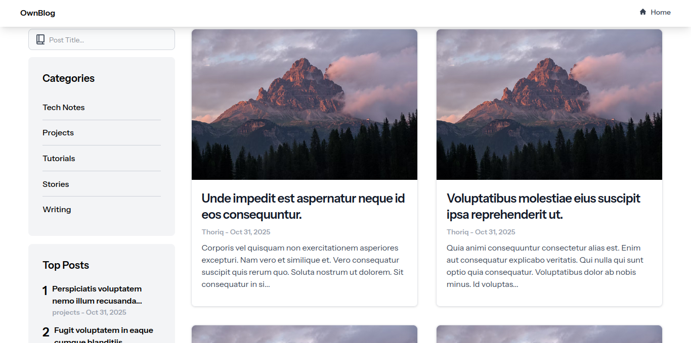
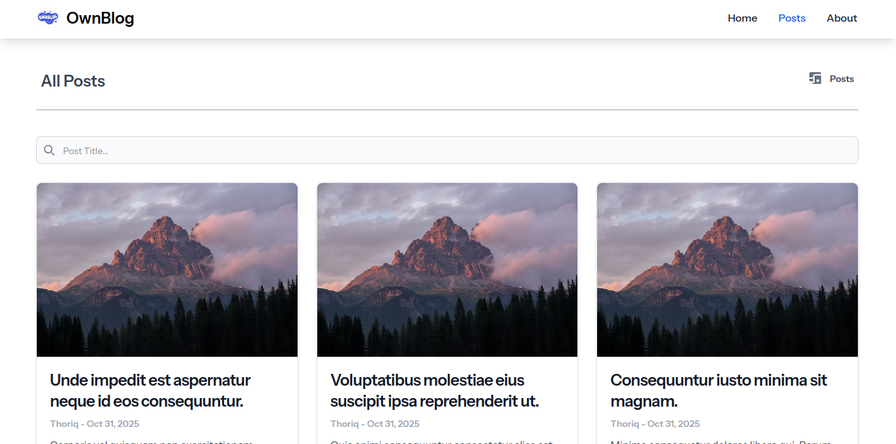
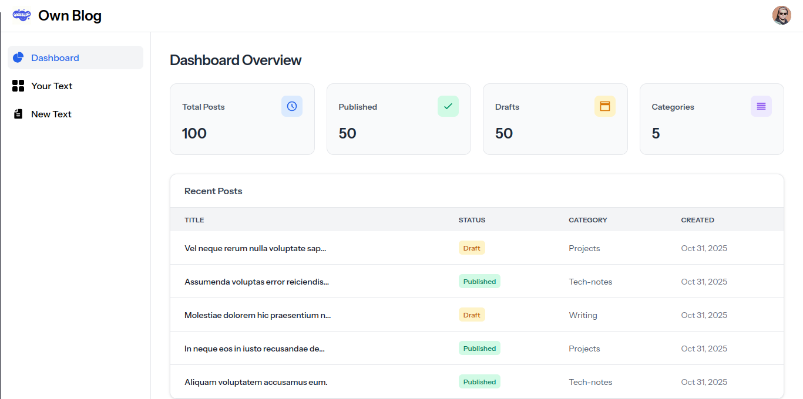
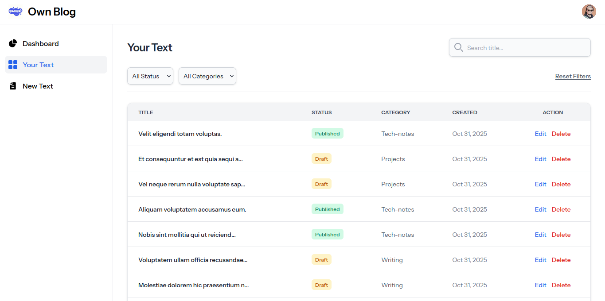
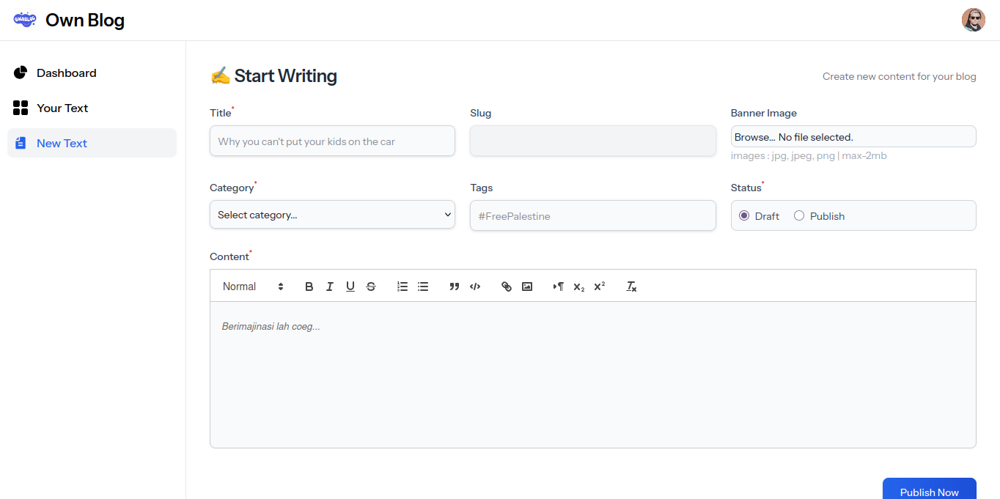

# 📰 OwnBlog

**OwnBlog** adalah platform blog pribadi yang dibangun dengan **Laravel 12 + Livewire 3**.  
Project ini berfokus pada pengalaman menulis yang sederhana: konten utama disimpan dalam format **Markdown (`.md`)**, banner disimpan terpisah di storage, dan tampilan guest/admin dirancang untuk workflow baca-tulis yang nyaman.

---

## 🚀 Deskripsi Singkat

OwnBlog dibuat sebagai project pribadi yang berfungsi sebagai **portfolio sekaligus playground** untuk eksplorasi Laravel, Livewire, dan alur CMS ringan berbasis file.

Tujuan utamanya:
- membangun blog modern dengan workflow admin yang ringkas
- menyimpan isi artikel sebagai file Markdown agar lebih mudah dirawat
- menjaga UI guest/admin tetap nyaman dipakai untuk membaca dan menulis

---

## ⚙️ Tech Stack & Dependencies

### 🧱 Backend (Composer)
| Package | Fungsi |
|----------|--------|
| `laravel/framework` | Core framework |
| `livewire/livewire` | Komponen interaktif tanpa JavaScript manual |
| `intervention/image` | Kompresi dan manipulasi banner |
| `mews/purifier` | Sanitasi konten HTML/Markdown |


### 🎨 Frontend (NPM)
| Package | Fungsi |
|----------|--------|
| `tailwindcss` | CSS framework utility-first |
| `@tailwindcss/typography` | Styling untuk konten artikel |
| `flowbite` | Komponen UI tambahan berbasis Tailwind |
| `alpinejs` | Interaksi ringan di sisi client |
| `marked` | Render Markdown ke HTML untuk preview |
| `dompurify` | Sanitasi hasil render preview Markdown |

---

## 🧩 Fitur yang Sudah Ada

✅ **Autentikasi dasar** (login/logout)  
✅ **CRUD konten blog** dengan admin panel  
✅ **Editor Markdown** dengan preview real-time  
✅ **Toolbar Markdown**: heading, bold, italic, quote, list, table, code, link  
✅ **Konten disimpan sebagai file `.md`** di storage, bukan isi utama di database  
✅ **Upload & kompres banner otomatis**  
✅ **Guest search + pagination**  
✅ **Top posts berdasarkan views**  
✅ **Dark / light mode** untuk guest dan admin  
✅ **Seeder demo** untuk admin dan konten awal  
✅ **Responsive UI** dengan Tailwind + Flowbite  

---

## 🧠 Cara Install Project

### 1️⃣ Clone Repository
```bash
git clone https://github.com/Thoriq0/OwnBlog.git
cd OwnBlog
```

### 2️⃣ Install Dependencies
**Backend:**
```bash
composer install
```
**Frontend:**
```bash
npm install
```

### 3️⃣ Setup Environment
```bash
cp .env.example .env
php artisan key:generate
```
**Lalu sesuaikan konfigurasi database di file .env:**
```bash
DB_CONNECTION=mysql
DB_HOST=127.0.0.1
DB_PORT=3306
DB_DATABASE=ownblog
DB_USERNAME=root
DB_PASSWORD=your_password
```

### 4️⃣ Storage Link
Project ini menggunakan public storage untuk banner, jadi jalankan:
```bash
php artisan storage:link
```

### 5️⃣ Migration & Seeder
```bash
php artisan migrate --seed
```

Seeder akan otomatis membuat:
- 1 akun admin demo
- 20 konten dummy
- file Markdown kosong untuk setiap konten
- banner dummy publik untuk kebutuhan tampilan awal

Credential admin demo:
```bash
'name' => 'Test User',
'email' => 'admin@admin.com',
'password' => 'password',
'role' => 'admin',
```

### 6️⃣ Running Project
Cara paling praktis:
```bash
composer run dev
```

Atau jalankan manual:
```bash
php artisan serve
npm run dev
```

Project akan berjalan di `http://127.0.0.1:8000`

Route penting:
- guest home: `http://127.0.0.1:8000/`
- login admin: `http://127.0.0.1:8000/login`
- dashboard admin: `http://127.0.0.1:8000/dashboard`

---

## 🗂️ Struktur Penyimpanan Konten

Artikel disimpan dalam dua bagian:

### Database
Database menyimpan metadata seperti:
- title
- slug
- category
- tags
- status
- views
- `content_path`

### File Storage
- isi artikel Markdown disimpan di:
  `storage/app/private/contents/{slug}/content.md`
- banner disimpan di:
  `storage/app/public/contents/{slug}/banner.{ext}`

Pendekatan ini bikin isi artikel lebih gampang dipindah, di-backup, dan di-maintain tanpa menjejalkan body content penuh ke database.

---

## 🧪 Testing

Untuk menjalankan test:
```bash
php artisan test
```

**🌟 Coming Soon**
- 🚧 Settings user
- 🚧 Sign up Form
- 🚧 Optimasi tag
- 🚧 Tag & kategori dinamis
- 🚧 Manajemen media yang lebih rapi
- 🚧 Easy installer


## **Preview**
---

### 🏠 Home


### 📄 Page


---

### 🧭 Admin Dashboard


### 🧾 Content List


### 📝 Content Form

